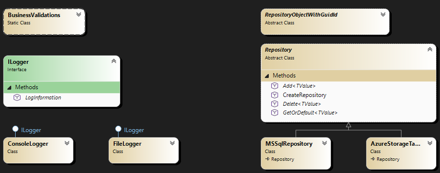
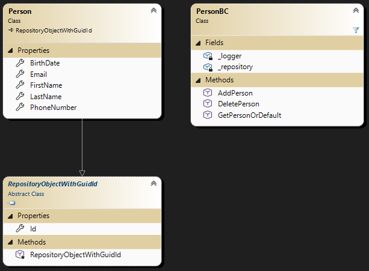

# DIY Dependency injection

## Introductie

In deze sectie gaan we dieper in op Dependency Injection (DI) in .NET. DI is een ontwerpprincipe dat helpt bij het creëren van flexibele, herbruikbare en testbare code.

We zullen de basisprincipes van DI verkennen, evenals enkele veelvoorkomende patronen en technieken die in .NET worden gebruikt.

We doen dit geheel aan de hand van een voorbeeld waarbij nog geen DI gebruikt is. In dit voorbeeld beschikken we over een framework voor het maken van Business componenten.

Dit framework had als doelen:
- Generieke logging want we ondersteunen console apps en webhosts
  - Console => Console.WriteLine
  - Web => Log file
- Meerdere databases ondersteunen
  - MsSQL
  - Azure Tables

Dit framework is opgebouwd uit een aantal lagen zoals in onderstaand plaatje is weergegeven.


Daarnaast levert het framework ook een aantal veel gebruikte validaties mee (`BusinessValidations`) en er zijn uiteraard wat unit tests geschreven voor deze validaties `BusinessValidationsTests`.

Voor de business logic bouwen we business componenten die gebruik maken van de verschillende lagen uit het framework. In dit voorbeeld hebben we een `PersonBC` die personsen kan toevoegen. Het `PersonBC` gebruikt de onderliggende `Person` object welke is afgeleid van de `RepositoryObjectWithGuidId` uit het framework, waardoor we deze via de respository kunnen benaderen in de storage.

Dit zie je terug in het odnerstaande model.


We zien dat de `PersonBC` gebruik maakt van de `ILogger` en `Repository` classes uit het framework. In de huidige implementatie worden deze afhankelijkheden direct in de constructor meegegeven. Dit zorgt ervoor dat je overal waar je functies op de BC wilt aanroepen deze logger en storage settings moet kunnen opvragen. 

Vaak zien we oplossingen waarbij de logger en/of storage settings als statische variabelen worden opgeslagen, zodat deze overal beschikbaar zijn. 

Voorbeeld:
```csharp
public class StorageSettings
{
  public StorageType StorageType { get; set; }
  public string? MsSqlConnectionString { get; set; }
  public string? AzureStorageTableEndpoint { get; set; }
  public string? AzureStorageTableSasSignature { get; set; }

  // NIET DOEN!
  public static StorageSettings Current {
    get
    {
      return field ??= JsonSerializer.Deserialize<StorageSettings>(File.ReadAllText("storageSettings.json"))!;
    }
  }
}
```

Belangrijkste reden om dit niet te doen... Unit testing!

In een unit tests draaien meerdere tests achter elkaar binnen 1 process waardoor static variabelen niet opnieuw geïnitialiseerd worden. Hierdoor kunnen tests onbedoeld van elkaar afhankelijk worden.

## Definitie van een goede unit test

- Atomisch
- Deterministisch
- Herhaalbaar
- Onafhankelijk van volgorde &  geïsoleerd
- Snel (ms)
- Makkelijk om op te zetten

Om snel te zijn wordt in een unit test het proces hergebruikt. Een gegarandeerde manier om een goede unit test te breken is gebruik maken van static en threadstatic variabele. We moeten dus een andere oplossing voor de afhankelijkheden vinden.

Unit test framework zijn ook heel geschikt voor integratie tests, maar deze hoeven niet aan de bovenstaande regels te voldoen.

In de volgende secties gaan we stap voor stap de code aanpassen om Dependency Injection toe te passen en zo de afhankelijkheden beter beheersbaar te maken.

We beginnen met met het aanmaken en starten van .NET Core Dependency Injection container in de huidige applicatie.

Voer de stappen uit in het hoofdstuk **Na sheet 8: Eerste stappen Core DI** van [Steps.md](Steps.md#na-sheet-8-eerste-stappen-core-di)

## Core DI voordelen

De core DI container biedt de volgende voordelen t.o.v. de oude implementatie:

- Singletons (bv ILogger) zijn geregistreerd in de host en dus per host.
  - Meerdere unit tests = hosts per unit test, dus steeds een schone situatie.
- Constructor dependency injection
  - Het DI framework lost automatisch de dependencies op en injecteert deze in de constructor.
  - Extra dependency, dan alleen constructor uitbreiden
  - Circulaire dependency worden automatisch gedetecteerd en daarmee voorkomen.
  - Cleanup automatisch gemanaged (IDisposable, IAsyncDisposable wordt automatisch aangeroepen)

## Core DI levensduur en delen

Core DI ent verschillende levensduur opties voor geregistreerde services. Deze bepalen hoe lang een instantie van een service wordt bewaard en gedeeld binnen de applicatie.

|  | asp.net core | andere |
|---|---|---|
| Singleton | Elke plaats waar hij geïnjecteerd dezelfde instantie. | Elke plaats waar hij geïnjecteerd dezelfde instantie. |
| Transient | Elke plaats waar hij geïnjecteerd word een nieuwe instantie. | Elke plaats waar hij geïnjecteerd word een nieuwe instantie. |
| Scoped | Elke plaats waar hij geïnjecteerd word dezelfde instantie per web request, maar niet gedeeld over webrequests. | Elke plaats waar hij geïnjecteerd word dezelfde instantie per scope, maar niet gedeeld over scopes. (Framework) developer moet zelf scopes creëren anders singleton. |

Let op: Scoped wil je dus vrijwel nooit gebruiken, slechts in specifieke gevallen als de contexten ook helemaal duidelijk zijn, zoals bij asp.net core.

## Core DI veilige dependencies

|  | Singleton | Scoped | Transient |
|---|:---:|:---:|:---:|
| Singleton<br/>(parallel safe) | V | X | X |
| Scoped<br/>(niet-parallel safe?) | V | V | X |
| Transient<br/>(niet-parallel safe) | V | V | V |

- V = veilig
- X = niet veilig

Met parallel safe wordt bedoeld dat de instantie methodes van het object gelijktijdig door meerdere threads kunnen worden aangeroepen zonder dat dit problemen oplevert en dat er meerdere async methodes aangeroepen mogen worden voordat de andere async afgehandeld is.

### Uitleg

- Singleton services moeten alleen afhankelijk zijn van andere singleton services. Dit komt omdat singleton services gedeeld worden over de gehele levensduur van de applicatie en dus ook over meerdere threads/async calls. De instantie methodes van het object moeten dus parallel zijn.
- Scoped services kunnen afhankelijk zijn van singleton en andere scoped services, maar niet van transient services. Dit komt omdat scoped services gedeeld worden binnen een bepaalde scope (zoals een web request). Afhankelijk van de implementatie van de scope kan het zijn dat meerdere threads/async calls binnen dezelfde scope plaatsvinden, waardoor er gedeelde staat kan ontstaan. Hoewel asp.net core dit standaard niet doet, kan een framework developer ervoor kiezen om dit wel te doen. Let dus goed op de documentatie van het framework dat je gebruikt.
- Transient services kunnen afhankelijk zijn van singleton, scoped en andere transient services. Dit komt omdat transient services elke keer een nieuwe instantie creëren wanneer ze worden opgevraagd. Een transient service wordt dus nooit gedeeld, waardoor er geen problemen ontstaan met gedeelde staat en je instantie methodes dus ook niet parallel safe hoeft te bouwen.

Voer de stappen uit in het hoofdstuk **Na sheet 12: PersonBC & CrmValidations unit tests** van [Steps.md](Steps.md#na-sheet-12-personbc--crmvalidations-unit-tests)

### Wat hebben we geleerd?

- Gebruik geen static of threadstatic variabele
- Refactor t.b.v. testen is normaal
- FakeItEasy t.b.v. fake dependencies
- InternalsVisibleTo() t.b.v. testen van internals

## Herbruikbare unit tests

Voer de stappen uit in het hoofdstuk **Na sheet 14: Repository unit tests** van [Steps.md](Steps.md#na-sheet-14-repository-unit-tests)

## Configuration via DI

Als we kijken naar de `StorageSettings` class dan kan hier wel het e.e.a. aan verbeterd worden.

De framework bouwers hebben een mooi lijstje verzameld:

- StorageSettings bevat instellingen van MsSql & AzureStorageTable
  - Wat als we 20 verschillende providers hebben?
  - We geven nu overal alle settings mee, ook al gebruiken we ze niet.
  - Het is nu niet duidelijk welke settings van toepassing in welke situatie?
- We willen graag settings op meerdere manieren kunnen specificeren:
  - In command line als command line parameter. 
  - In lokale webserver in appsettings.json
  - In azure web app/docker container in Environment variables

Voer de stappen uit in het hoofdstuk **Na sheet 16: Configuration in Core DI** van [Steps.md](Steps.md#na-sheet-16-configuration-in-core-di)

### Bronnen IConfiguration

- AppSettings.json
- AppSettings.{IHostConfiguration.Environment}.json
- User secrets (only in development environment)
- Environment variables
- Command line args

- Eigen bronnen kunnen toegevoegd worden.
- Subobjecten in appsettings en lijsten zijn tevens mogelijk. (GetSection())

### Uitlezen IConfiguration

We kunnen de instellingen op verschillende manieren uitlezen:

|  | Is een | Wanneer bijgewerkt |
|---|---|---|
| Options<T> | Singleton | Eenmalig ingelezen |
| OptionsSnapshot<T> | Scoped | Bij iedere scope opnieuw ingelezen, bij aspnet core dus iedere request |
| OptionsMonitor<T> | Singleton | Geeft wijziging notificaties<br/>Is herlaadbaar |

## Logging via DI

Als we kijken naar de `Logging` classes dan kan hier ook het e.e.a. aan verbeterd worden.

De framework bouwers hebben een mooi lijstje verzameld:
- Wat als we meerdere locaties willen loggen (zowel file als console).
- Wat als we opentelemetry willen implementeren.
- Wat als we voor een gedeelte van de software meer willen loggen.
- Wat als we 3de partij componenten gebruiken die ook logging hebben.

Voer de stappen uit in het hoofdstuk **Na sheet 20: Logging in Core DI** van [Steps.md](Steps.md#na-sheet-20-logging-in-core-di)

### Uitvoermogelijkheden

- Console
- Debug
- EventSource

- Er zijn standaard nuget packages voor logging naar oa: Opentelemetry.
- Via configuration kunnen log levels per namespace/class ingesteld worden.

## Best practices

Voer de stappen uit in het hoofdstuk **Na sheet 25: Overgeslagen** van [Steps.md](Steps.md#na-sheet-25-overgeslagen)